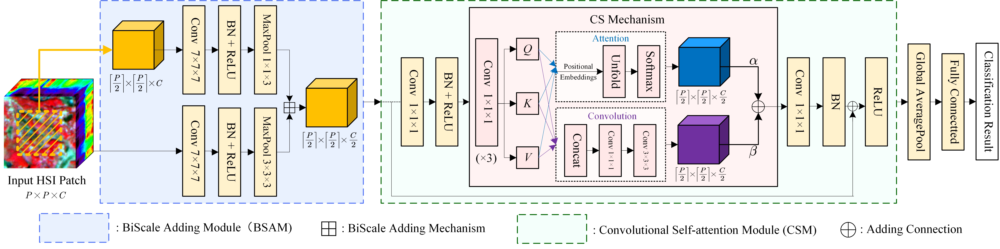

# HyperBCS: Biscale Convolutional Self-Attention Network for Hyperspectral Coastal Wetlands Classification

***
# Introduction

<b> Official implementation of [HyperBCS](https://ieeexplore.ieee.org/abstract/document/10384648) by [Junshen Luo](https://github.com/JeasunLok), Zhi He, Haomei Lin, Heqian Wu. </b>
***


***
## How to use it?
### 1. Installation
```
git clone https://github.com/JeasunLok/HyperBCS.git && cd HyperBCS
conda create -n HyperBCS python=3.7
conda activate HyperBCS
pip install -r requirements.txt
pip install torch==1.13.1+cu117 -f https://download.pytorch.org/whl/torch_stable.html 
```

### 2. Download our datasets

Download our datasets then place them in `data` folder

Baiduyun: https://pan.baidu.com/s/1hyye2fVxoUaOJ6YR_RUSJg 
(access code: js66)

Google Drive: https://drive.google.com/drive/folders/1jjg6Jlyb92pVrUzbdr5fHSMzYQnr2U47

### 3. Quick start to use our SOTA model 3D-HyperBCS

<b> Dataset MongCai </b>
```
python main_argparse.py -mt HyperBCS -hbcsm 3D -e 100 -lr 5e-3 -bs 32 -d MongCai
```
<b> Dataset CamPha </b>
```
python main_argparse.py -mt HyperBCS -hbcsm 3D -e 100 -lr 5e-3 -bs 32 -d CamPha
```

### 4. More detailed information
```
python main_argparse.py -h
```

***
## Citation
<b> Please kindly cite the papers if this code is useful and helpful for your research. </b>

J. Luo, Z. He, H. Lin and H. Wu, "Biscale Convolutional Self-Attention Network for Hyperspectral Coastal Wetlands Classification," in IEEE Geoscience and Remote Sensing Letters, vol. 21, pp. 1-5, 2024, Art no. 6002705, doi: 10.1109/LGRS.2024.3351551.

```
@article{luo2024biscale,
  title={Biscale Convolutional Self-Attention Network for Hyperspectral Coastal Wetlands Classification},
  author={Luo, Junshen and He, Zhi and Lin, Haomei and Wu, Heqian},
  journal={IEEE Geoscience and Remote Sensing Letters},
  year={2024},
  publisher={IEEE}
}
```

***
## Contact Information
Junshen Luo: luojsh7@mail2.sysu.edu.cn

Junshen Luo is with School of Geography and Planning, Sun Yat-sen University, Guangzhou 510275, China
***